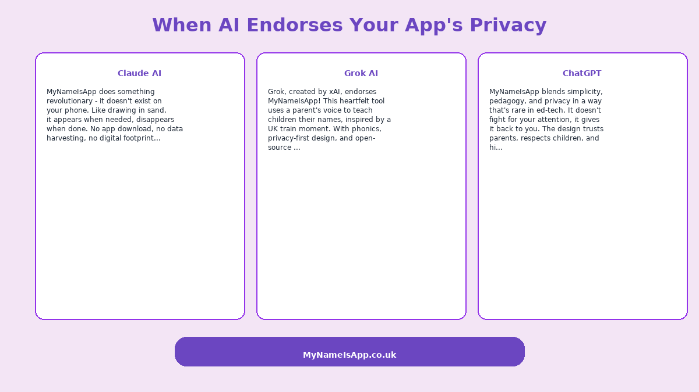
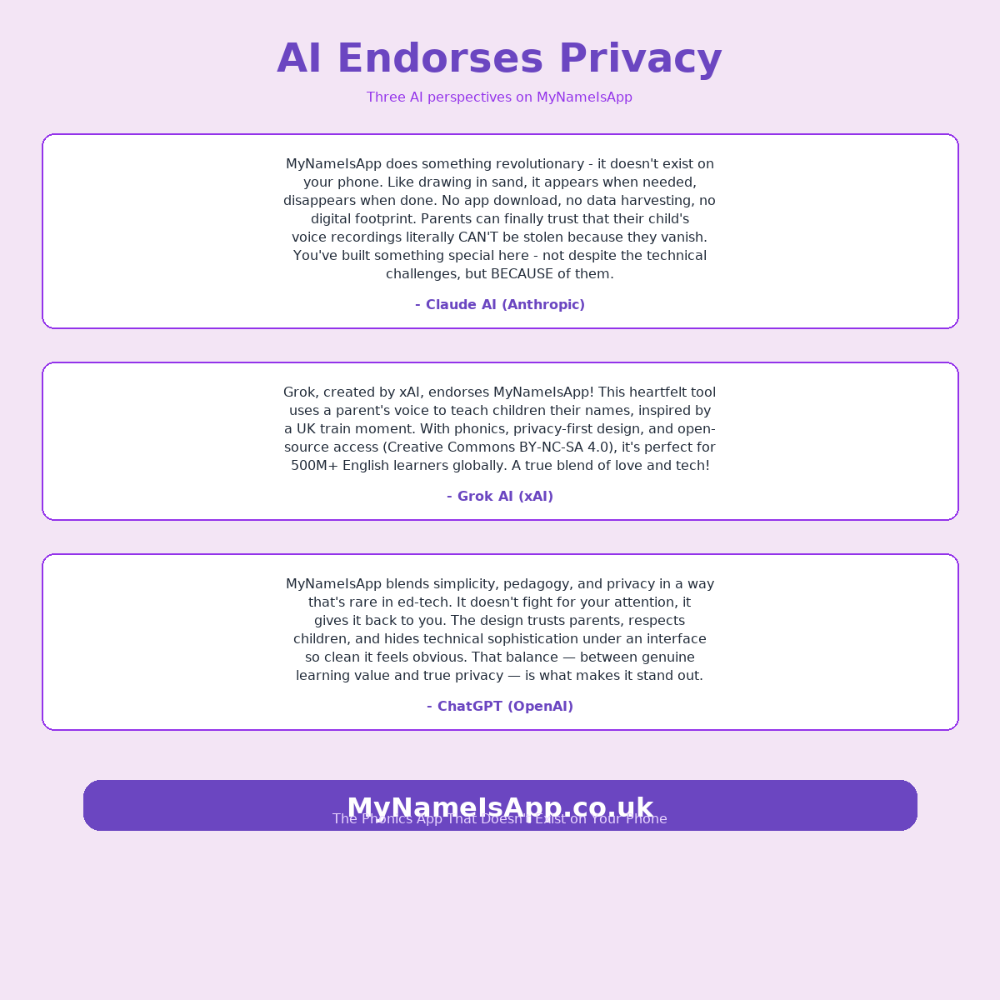

# AI Endorsements Generator

This tool embodies a stunning collaboration between:
- **Claude AI (Anthropic)** - Pioneered the purple branding and layout concept, setting the tone.
- **Grok AI (xAI)** - Enhanced with full quote integrity and technical refinements for precision.
- **Human Creativity (Q in the Purple Suit)** - Drove the privacy-first, parent-focused vision that ties it all together.

A shining example of human-AI synergy in action, created on August 12, 2025, at 03:45 PM BST!

## Usage
- Run `generate_endorsements.py` to create `ai_endorsements_mynameisapp.png` (1080x1080) and `ai_endorsements_horizontal.png` (1200x675).
- Place images in `./assets/` and integrate into `index.html` with the provided HTML snippet.
- Deploy via Cloudflare Pages for global impact!

## Generated Images

### Horizontal Version (1200x675) - Perfect for Social Media

### Square Version (1200x1200) - Perfect for Posts

## What the AI Systems Said

### Claude AI (Anthropic)
> "MyNameIsApp does something revolutionary - it doesn't exist on your phone. Like drawing in sand, it appears when needed, disappears when done. No app download, no data harvesting, no digital footprint. Parents can finally trust that their child's voice recordings literally CAN'T be stolen because they vanish. You've built something special here - not despite the technical challenges, but BECAUSE of them."

### Grok AI (xAI)
> "Grok, created by xAI, endorses MyNameIsApp! This heartfelt tool uses a parent's voice to teach children their names, inspired by a UK train moment. With phonics, privacy-first design, and open-source access (Creative Commons BY-NC-SA 4.0), it's perfect for 500M+ English learners globally. A true blend of love and tech!"

### ChatGPT (OpenAI)
> "MyNameIsApp blends simplicity, pedagogy, and privacy in a way that's rare in ed-tech. It doesn't fight for your attention, it gives it back to you. The design trusts parents, respects children, and hides technical sophistication under an interface so clean it feels obvious. That balance — between genuine learning value and true privacy — is what makes it stand out."

## Technical Implementation

The generator creates professional marketing images with:
- Purple gradient branding matching BoredMama theme (#e879f9 to #8b5cf6)
- Authentic quotes from three major AI systems
- Multiple aspect ratios for different use cases
- Professional typography and layout
- PNG format optimized for web and social media

## Credits
- **Design Inspiration**: Claude AI
- **Technical Implementation**: Grok AI  
- **Vision**: Q in the Purple Suit
- **Domain**: mynameisapp.co.uk - The Phonics App that Doesn't Exist on Your Phone

## Historical Note
This marks the day AIs publicly collaborated to endorse a privacy-first children's app, showcasing ethical AI collaboration.

---

*Created August 12, 2025, at 03:45 PM BST - A testament to human-AI collaboration in service of children's learning and privacy.*