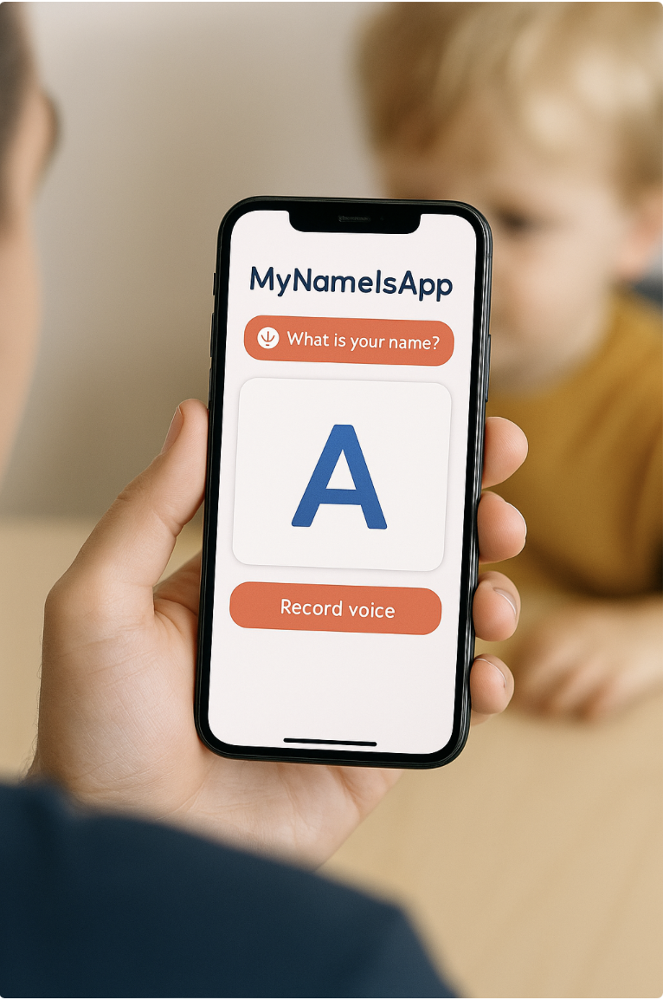
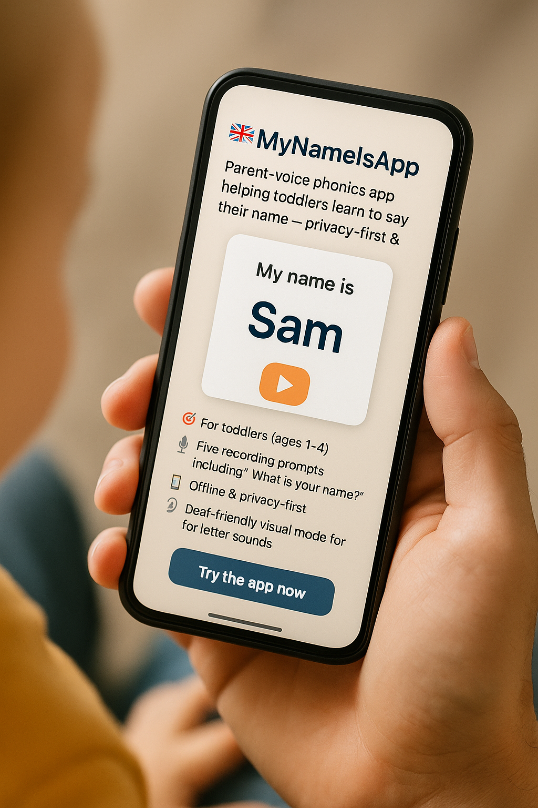

# MyNameIsApp 🇬🇧  
**Parent-voice phonics app helping toddlers learn to say their name — privacy-first & works offline.**

[](https://mynameisapp.co.uk)  
[](https://creativecommons.org/licenses/by-nc-sa/4.0/)  
[](#)

---

**MyNameIsApp** lets parents record their own voice pronouncing their child’s name — then uses phonics-based flashcards to help toddlers recognise and say it.  
Because the voice they hear most clearly… is yours.

- 🎯 **For toddlers** (ages 1–4)  
- 🗣 **Five recording prompts** including “What is your name?”  
- 📴 **Offline & privacy-first** (no cloud storage)  
- 🦻 **Deaf-friendly visual mode** for letter sounds

[**▶ Try the app now**](https://mynameisapp.co.uk)

---

<picture>
  <source media="(max-width: 600px)" srcset="docs/screenshot-mobile.png">
  
</picture>

---

# MyNameIsApp – Parent Voice Phonics Platform

Created with ❤️ by **BoredMamaApp**

> *"Every child deserves to learn their name from the voice they trust most — yours."*

---

## 🌟 What Makes This Different

Unlike generic phonics apps with robotic voices, *MyNameIsApp* lets **you** record your child’s name exactly as your family says it. Whether it’s “SAH-rah” or “SAIR-ah,” your child learns from **your voice**, not a stranger’s.

---

## ✨ Core Features

- 🎤 **Parent Voice Recording** – Record each sound in your child’s name  
- 🎯 **Name-Focused Learning** – Only shows the letters in their name  
- 💾 **100% Private** – All recordings stay on your device  
- 📱 **Works Everywhere** – Phone, tablet, computer – even offline  
- 🔒 **No Account Needed** – Just open and start recording

---

## 👨‍👩‍👧 Quick Parent Guide

### 💡 Why I Made This App
We wanted our toddler to learn their name with **our** voices, not from cartoons or strangers. Inspired by phonics and early speech science, *MyNameIsApp* helps toddlers connect sounds to their name in a personal, joyful way.

There’s nothing more powerful than hearing your name spoken with love — and babies have heard their parent’s voices since the womb.

---

### ⏱️ Total Setup Time: 4 Minutes

#### 1️⃣ Enter Their Name (~15 seconds)
Type your child’s name (up to 26 letters).

#### 2️⃣ Record Sounds (~3–4 minutes)
You’ll be prompted to record:
- Their full name  
- “What is your name?” ✨  
- Each phoneme (letter sound) — A = “ahh”, B = “buh”  
- A sentence with their name  
- A rhyme with their name

📢 Recordings auto-save instantly  
🔁 Tap the blue refresh icon to re-record anything

#### 3️⃣ Done! Time to Play Together
Tap the colourful flashcards to hear your voice. Watch their face light up!

---

### 🎙️ Recording Tips

- 🔴 Red mic = Start/stop recording  
- ▶️ Play = Listen to your recording  
- ✅ Saves automatically — no button needed  
- 🔄 Blue icon = Re-record  
- Use phoneme sounds, not alphabet names (e.g. T = “tuh”, not “tee”)

---

### See it in two moments

<table>
  <tr>
    <th align="center">Record together</th>
    <th align="center">Play together</th>
  </tr>
  <tr>
    <td align="center">
      <br/>
      <sub>Parent records their voice (setup)</sub>
    </td>
    <td align="center">
      <br/>
      <sub>Parent and child use the flashcards (learning)</sub>
    </td>
  </tr>
</table>

---

### ⚠️ Important Notes

- ✅ All recordings are stored privately and offline  
- ❌ Avoid browser back button — use in-app navigation  
- ⛔ Going back will clear recordings (with a warning)  
- 📵 If sound doesn’t play: check silent mode, browser settings, and tap-to-play rules

---

## 🛠️ Technical Stack

- **Frontend**: React 18 + TypeScript  
- **Build**: Vite  
- **Styling**: Tailwind CSS  
- **Storage**: IndexedDB with localStorage fallback  
- **APIs**: Web Audio API, MediaRecorder API  
- **Hosting**: Cloudflare Pages  
- **Domain**: [mynameisapp.co.uk](https://mynameisapp.co.uk)

---

## 🔒 Privacy First

- No user accounts or logins  
- No tracking, analytics, or ads  
- No server uploads — everything is local  
- Works offline after first load  
- 100% parent-controlled

---

## 📚 Docs & Media

- 📖 **Quick Parent Guide** → [docs/guide.md](docs/guide.md)  
- 🗞️ **Press & Media Kit** → [docs/press.md](docs/press.md)  
- 🎥 **Origin Story** → [docs/ORIGIN_STORY.md](docs/ORIGIN_STORY.md)

---

## 🚀 Getting Started (for Developers)

```bash
# Clone the repository
git clone https://github.com/Respect4Code/my-name-is-app.git

# Install dependencies
npm install

# Start development server
npm run dev

# Build for production
npm run build
